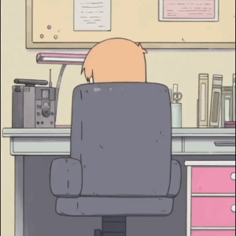

## Hi, I am Grey 👋

<table>
    <tr>
        <td width="200">
            

                
            

        </td>
        <td width="1000" valign="top">
            

                <b>Age:</b> 24  
                <b>Gender:</b> Male  
                <b>From:</b>  /   
                <b>Based in:</b>   
                <b>Languages:</b>     
                <b>Wants to learn:</b>     
            
 
        </td>
    </tr>
</table>

<table valign="top" width="1000">
    <tr>
        <td valign="top"  width="800">
            <h2>Info</h2>
            💻 <code>Computer Science Student</code> at  <code>Nanyang Technological University</code>   
            🛠️ Just wanna <code>have fun</code> and build <code>cool things</code>
        </td>
        <td width="200">
            
            <h3>Contact</h3>
            

                  
                
            

        </td>
    </tr>
</table>

<table>
    <tr>
        <td>
          
        </td>
        <td>
          
        </td>
    </tr>
</table>

<table>
    <tr>
        <td width="40%">
            
        </td>
        <td>
            

                 
                 
                 
                 
                 
                 
                 
                 
                 
                 
                 
                 
                 
                 
                 
                 
                 
                 
                
            

        </td>
    </tr>
</table>

<table>
    <tr>
        <td width="1200">
            
        </td>
    </tr>
</table>

<table>
    <tr>
        <td width="1200">
            

                
<h2 align="center">Hackathons </h2>

                <table>
                    <tr>
                        <td><a href="https://github.com/IAmGreyBunny/sogni_comic">Sogni-Comic</a></td>
                        <td>🏅Finalist</td>
                    </tr>
                    <tr>
                        <td><a href="https://github.com/IAmGreyBunny/SummerBuild2025">NTU SummerBuild 2025</a></td>
                        <td>🏅Best in Innovation</td>
                    </tr>
                    <tr>
                        <td><a href="https://github.com/IAmGreyBunny/ICTCompetition">Huawei ICT Competition 2021-2022</a></td>
                        <td>
                            🥇First Prize - National  
                            🥉Third Prize - Global 🌏
                        </td>
                    </tr>
                </table>
            

        </td>
    </tr>
    <tr>
        <td width="1200">
            

                
<h2 align="center">School Projects </h2>

                <table>
                    <tr>
                        <td><a href="https://github.com/IAmGreyBunny/SC2008-Labs">SC2008-Labs</a></td>
                        <td>NTU SC2008 - Networking</td>
                    </tr>
                    <tr>
                        <td><a href="https://github.com/IAmGreyBunny/SC2006-CommuteBuddy">SC2006-CommuteBuddy</a></td>
                        <td>NTU SC2006 - Software Engineering</td>
                    </tr>
                    <tr>
                        <td><a href="https://github.com/IAmGreyBunny/SC2001-Labs">SC2001-Labs</a></td>
                        <td>NTU SC2001 - Algorithm Design & Analysis</td>
                    </tr>
                    <tr>
                        <td><a href="https://github.com/IAmGreyBunny/SC2002-FCS5-Grp5">SC2002-FCS5-Grp5</a></td>
                        <td>NTU SC2002 - Object Oriented Programming</td>
                    </tr>
                    <tr>
                        <td><a href="https://github.com/IAmGreyBunny/OnTrack">OnTrack</a></td>
                        <td>NTU SP DCPE - Object Oriented Programming</td>
                    </tr>
                </table>
            

        </td>
    </tr>
    <tr>
        <td width="1200">
            

                
<h2 align="center">Research </h2>

                <table>
                    <tr><td><a href="https://github.com/IAmGreyBunny/URECA">URECA</a></td></tr>
                </table>
            

        </td>
    </tr>
    <tr>
        <td width="1200">
            

                
<h2 align="center">Personal Projects </h2>

                <table>
                    <tr><td><a href="https://github.com/IAmGreyBunny/google-image-webscraper">google-image-webscraper</a></td></tr>
                </table>
            

        </td>
    </tr>
</table>
